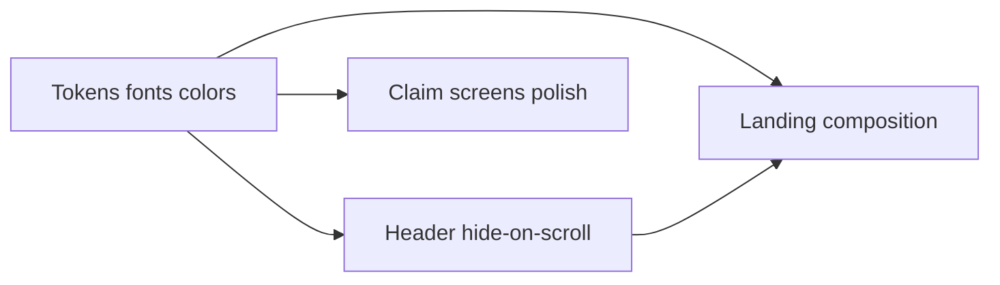

# Gov-trust + futuristic UI pass

**Overview:** A focused visual-system + marketing-UX pass that makes Claim Pre-Flight read as Digital Public Infrastructure: institutional trust with futuristic precision — new type pairing, Heron-inspired scroll nav and hover-activate grids, tighter landing composition — applied to marketing shell and the claim demo path before Aug 28 submission.

**Design read:** Redesign of a public-sector service site for Indian citizens and hackathon judges, with a Digital Public Infrastructure language — calm institutional trust + precise systems UI (Heron/Linearity motion discipline), not Awwwards chaos and not GOV.UK grey boxes.

**Scope lock (deadline-aware):** Refresh tokens/fonts/nav globally; deeply restyle marketing landing + claim journey (login → status). Services directory inherits tokens only — no content rewrite. No GSAP, Magic MCP, shadcn rebuild, or 3D loaders this sprint (Usability + time).

## Todos

- [ ] Swap fonts to Sora + IBM Plex Sans/Mono; rewrite brand palette + globals to DPI ink/paper/teal system
- [ ] Client Header: hide on scroll-down / show on scroll-up; hero transparent → solid; app denser chrome
- [ ] Reshape marketing sections: brand-first hero, merge proof band, hover-activate check grid, trim ServiceBreadth
- [ ] Retoken claim journey; hover-activate checks; match-score meter; tighter timeline typography
- [ ] Mobile + e2e + reduced-motion smoke on name-mismatch demo path

---

## 1. Visual system (do first — everything inherits)

**Typography — replace Inter + Space Grotesk** in [`src/app/layout.tsx`](../src/app/layout.tsx):

| Role | New face | Why |
|------|----------|-----|
| Display | **Sora** | Geometric, slightly futuristic; not startup-Grotesk |
| Body | **IBM Plex Sans** | Institutional clarity; proper for public-sector UI |
| Mono | **IBM Plex Mono** | Same family as body; data/UAN/scores feel official |

Update Tailwind `fontFamily` in [`tailwind.config.ts`](../tailwind.config.ts). Tighten scale: display headlines with slightly tighter tracking; body 16–18px with comfortable leading; mono reserved for UAN, match scores, eyebrows.

**Palette — “DPI portal, independent”** (still distinct from EPFO official colors per existing honesty comment):

- Ink: near-black navy `#0B1220` (text / dark bands)
- Paper: cool off-white `#F4F6F8` (page)
- Surface: white with hairline `#E2E8F0` borders (less soft-shadow SaaS)
- Signal: precision teal `#0D9488` for “system check / ready” (not default Tailwind blue CTA)
- Brand CTA: deep indigo `#1E3A8A` (authority without EPFO teal clone)
- Status: keep green/amber/red for pass/warn/fail only

Rewrite `brand.*` tokens in [`tailwind.config.ts`](../tailwind.config.ts) and retarget `bg-slate-50` / `text-brand-*` usages that hardcode old blue.

**Signature element:** the existing [`IdentityGraph`](../src/components/IdentityGraph.tsx) becomes the product’s visual thesis — treated as a systems instrument (muted until active), not a card decoration.

---

## 2. Heron-inspired shell motion

Upgrade [`src/components/layout/Header.tsx`](../src/components/layout/Header.tsx) (client wrapper):

- **Scroll direction nav:** hide on scroll down, reveal on scroll up (pattern from heronaiapp / moto-card / lorolabs). Keep `sticky`; translateY off-screen instead of unmounting.
- **State:** transparent/hairline over marketing hero → solid paper + blur after scroll past hero.
- **Reduced motion:** always visible if `prefers-reduced-motion`.
- App variant: same hide/show, but denser operational chrome (slightly smaller height, mono UAN chip) so post-login feels like a portal, not a SaaS marketing bar.

Keep [`MockBanner`](../src/components/MockBanner.tsx) persistent and honest; do not animate it away.

**Page transitions (light):** use the View Transitions API or a small Framer `AnimatePresence` wrapper on marketing route changes only — content eases; no full “grids fly to center” rebuild (too risky for 3 days). Optional: Identity Graph nodes briefly converge on route change if time remains after core polish.

---

## 3. Landing composition — less scatter, more Heron density

Current home is 9 card-stacked sections ([`src/app/(marketing)/page.tsx`](../src/app/(marketing)/page.tsx)). Condense to **one visual system** with fewer sections:

| Keep / reshape | Change |
|----------------|--------|
| Hero | Brand-first: product name at hero scale; Identity Graph as full-bleed or edge-anchored plane (not inset white card). One headline, one sentence, one CTA group. |
| Proof band | Merge StatRow + Tension into one quiet ink band (rejection rate + plain-language tension). |
| Checks | Replace 3 pastel cards in [`CheckPreviewGallery`](../src/components/marketing/CheckPreviewGallery.tsx) with a **muted grid that activates color on hover** (Heron pattern): idle = monochrome borders/labels; hover/focus = status color + detail. |
| How it works | Keep 3 steps but as a single horizontal process strip, not three equal cards. |
| Comparison | Keep before/after; hairline rules, less shadow. |
| FAQ + CTA | Keep; drop or shrink ServiceBreadthTeaser to a one-line link to `/services` so the story stays “one journey.” |

Extend [`Reveal`](../src/components/motion/Reveal.tsx) with 1–2 variants (fade, subtle scale) — still Framer only. Add intentional motions: graph node light-up, match-score meter fill, nav hide/show. Respect reduced motion.

Reference discipline from your lists: **heronaiapp** (nav + hover-activate + scroll calm), **linearity.io** (tight section jobs, editable-systems feel), **sly.systems / fplus** (minimal nav). Inspiration only — do not clone agency dark-maximal looks; trust-first dials override (`design-taste-frontend` public-sector: variance low, motion moderate).

---

## 4. Claim journey polish (demo path)

Apply the same tokens/type to:

- [`login`](../src/app/(marketing)/login/page.tsx), [`dashboard`](../src/app/(app)/dashboard/page.tsx), [`reason`](../src/app/(app)/claim/reason/page.tsx), [`preflight`](../src/app/(app)/claim/preflight/page.tsx), fix, status

Concrete UX upgrades (no new features):

- Preflight check rows: same hover-activate status treatment as marketing checks.
- Match score: meter fill animation (CSS/SVG) — “wow per hour” from the build plan.
- Status timeline: clearer node lighting sequence (already exists; tighten typography/spacing).
- Buttons/cards: reduce `rounded-2xl` + soft shadows toward sharper institutional radii (`rounded-lg`) and hairlines.

Do **not** change matchEngine / claim state logic.

---

## 5. Explicitly out of scope this pass

- Installing ui-ux-pro-max / Magic MCP / shadcn MCP / GSAP skills as new tooling
- 3D loaders, maps, UAN-merge feature
- Rewriting services catalog content
- Video / submission copy (separate Day 3 track after UI lands)

Skills to **use while implementing** (already local): `frontend-design`, `design-taste-frontend`, `web-typography`, `vercel-react-best-practices`, existing `framer-motion` patterns.

---

## 6. Verification

- Visual pass desktop + mobile on hero demo path (name-mismatch → fix → submit)
- `npm run test:e2e` — selectors may need updates if copy/structure changes
- Incognito + reduced-motion check
- Confirm MockBanner + independent-prototype labeling still visible

---

## Related docs

- [EPFO_Hackathon_Build_Plan.md](./EPFO_Hackathon_Build_Plan.md) — authoritative product/journey plan
- [EPFO_Redesign_Blueprint.md](./EPFO_Redesign_Blueprint.md) — full redesign architecture (roadmap)
